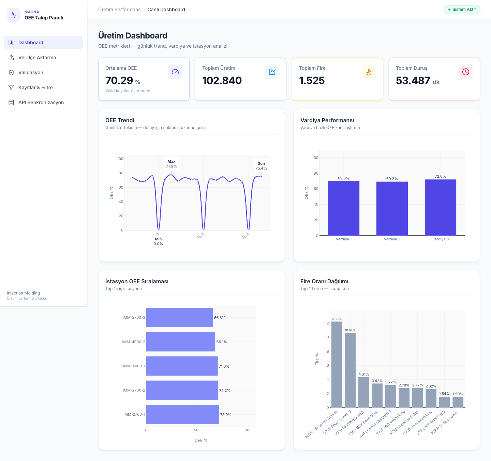
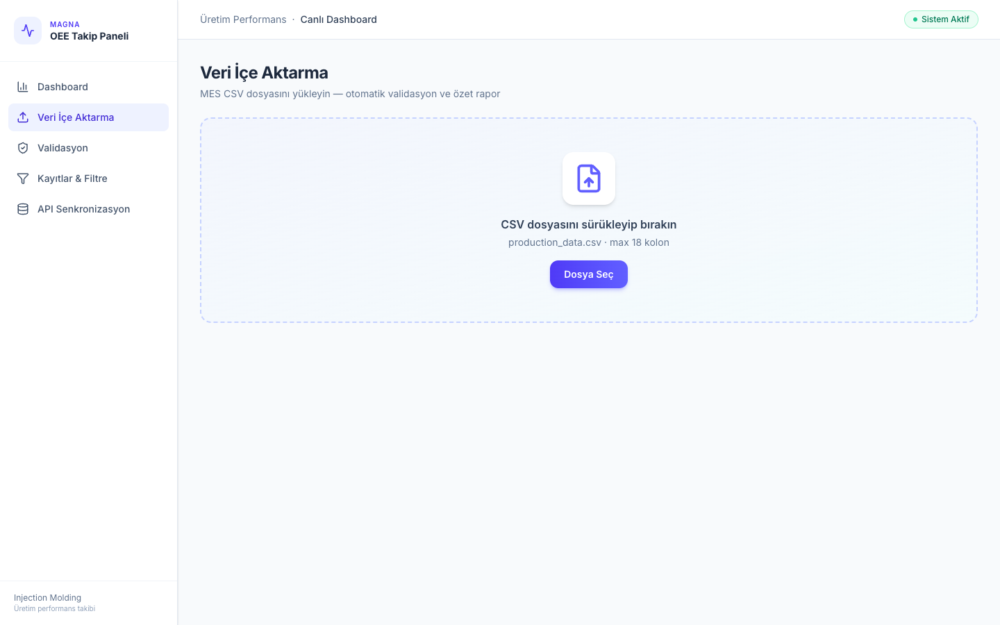
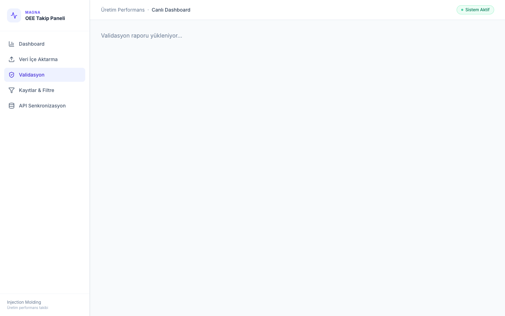
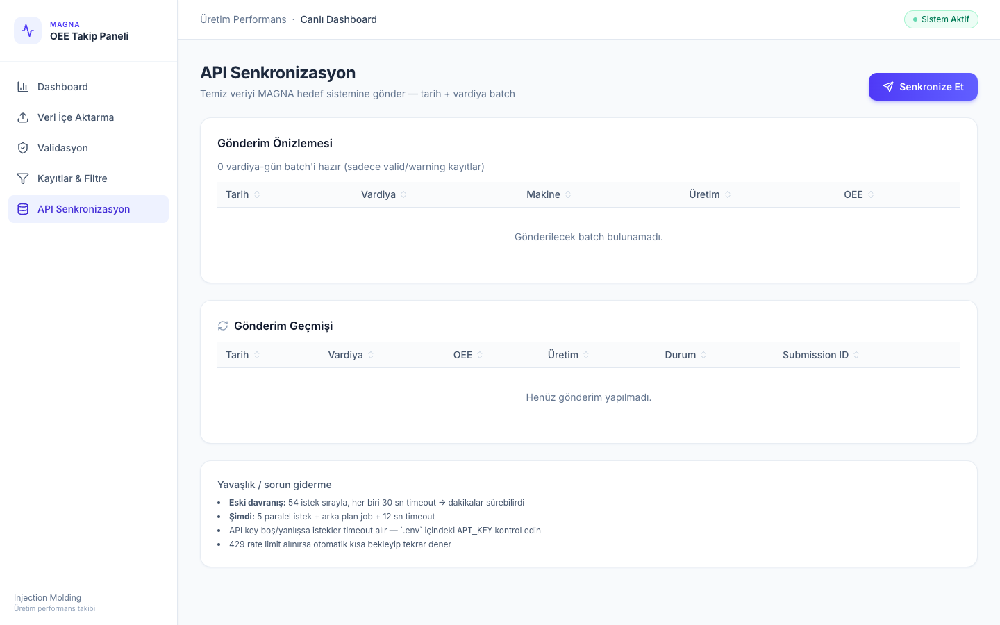

# Üretim Performans Takip Uygulaması — MAGNA Case Study

**Aday:** İrem Çınar  
**Repo:** https://github.com/iremcnr/-iremcinar--uretim-takip-case

Enjeksiyon kalıplama hattındaki OEE (Overall Equipment Effectiveness) metriklerini takip eden, CSV verisini validate eden ve temiz veriyi REST API üzerinden hedef sisteme gönderen full-stack web uygulaması.

---

## Gereksinimler

| Araç | Minimum sürüm |
|------|-----------------|
| Python | 3.9+ |
| Node.js | 18+ |
| npm | 9+ |
| Git | 2.x |

---

## Hızlı Başlangıç (3 komut)

```bash
git clone https://github.com/iremcnr/-iremcinar--uretim-takip-case.git
cd -iremcinar--uretim-takip-case
cp .env.example .env
```

Ardından aşağıdaki **Backend** ve **Frontend** bölümlerini iki ayrı terminalde çalıştırın.

---

## Detaylı Kurulum

### 1. Repoyu klonlayın

```bash
git clone https://github.com/iremcnr/-iremcinar--uretim-takip-case.git
cd -iremcinar--uretim-takip-case
```

### 2. Ortam değişkenlerini ayarlayın

Proje kökünde `.env.example` dosyasını `.env` olarak kopyalayın:

```bash
cp .env.example .env
```

`.env` dosyasını düzenleyin:

```env
DATABASE_URL=sqlite:///./production.db
API_BASE_URL=http://89.252.189.91:8983
API_KEY=your-production-key-here          # MAGNA'dan aldığınız key
SYNC_MAX_RETRIES=3
SYNC_RETRY_DELAY_SECONDS=2.0
CORS_ORIGINS=http://localhost:5173,http://127.0.0.1:5173
```

> **Önemli:** `API_KEY` olmadan uygulama çalışır; ancak **API Senkronizasyon** sayfasındaki gönderim işlemi başarısız olur.

### 3. Backend kurulumu (Terminal 1)

```bash
cd backend
python3 -m venv .venv
source .venv/bin/activate        # Windows: .venv\Scripts\activate
pip install -r requirements.txt
uvicorn main:app --reload --port 8000
```

Backend hazır olduğunda:
- API: http://localhost:8000
- Swagger dokümantasyon: http://localhost:8000/docs

### 4. Frontend kurulumu (Terminal 2)

```bash
cd frontend
npm install
npm run dev
```

Frontend hazır olduğunda:
- Uygulama: http://localhost:5173

### 5. Tek komutla başlatma (alternatif — macOS/Linux)

Proje kökünden:

```bash
chmod +x start.sh
./start.sh
```

Bu script backend + frontend'i birlikte başlatır; veritabanı boşsa `data/production_data.csv` dosyasını otomatik import eder.

---

## İlk Kullanım Adımları

1. Tarayıcıda **http://localhost:5173** adresini açın
2. Sol menüden **Veri İçe Aktarma** sayfasına gidin
3. `data/production_data.csv` dosyasını sürükleyip bırakın veya **Dosya Seç** ile yükleyin
4. Önizlemeyi kontrol edin → **İçe Aktar & Validate Et** butonuna tıklayın
5. Import özeti: ~1921 kabul, ~196 red, ~1083 uyarı (tipik sonuç)
6. **Dashboard** → OEE grafikleri ve KPI kartları
7. **Validasyon** → Hatalı/şüpheli kayıtları inceleyin, düzeltin veya reddedin
8. **Kayıtlar & Filtre** → Tarih, vardiya, istasyon filtreleri; CSV export
9. **API Senkronizasyon** → `.env` içindeki `API_KEY` ile temiz veriyi hedef sisteme gönderin

---

## PyCharm ile Çalıştırma

### Backend Run Configuration

1. **File → Open** → proje kök klasörünü seçin
2. **Settings → Python Interpreter** → `backend/.venv` sanal ortamını ekleyin
3. **Run → Edit Configurations → + → Python**
   - **Module name:** `uvicorn`
   - **Parameters:** `main:app --reload --port 8000`
   - **Working directory:** `backend`
4. ▶ Run

### Frontend

PyCharm terminalinde:

```bash
cd frontend && npm install && npm run dev
```

---

## Adresler

| Adres | Açıklama |
|-------|----------|
| http://localhost:5173 | Web uygulaması (React) |
| http://localhost:8000/docs | Backend OpenAPI (Swagger) |
| http://89.252.189.91:8983/docs-guide | Hedef MAGNA API dokümantasyonu |

---

## Proje Yapısı

```
├── backend/                 FastAPI REST API
│   ├── models/              SQLAlchemy ORM (records, issues, audit, sync)
│   ├── services/            validation, import, analytics, sync
│   ├── routers/             /api/import, /api/records, /api/sync
│   ├── tests/               pytest birim testleri
│   └── main.py              Uygulama giriş noktası
├── frontend/                React + TypeScript + Vite + Tailwind
│   └── src/pages/           Dashboard, Import, Validation, Records, Sync
├── data/
│   └── production_data.csv  Test verisi (2117 satır, 18 kolon)
├── docs/screenshots/        README ekran görüntüleri
├── ai_usage/                AI şeffaflık kayıtları
├── .env.example             Ortam değişken şablonu
└── start.sh                 Tek komut başlatma scripti
```

---

## Ekran Görüntüleri

### Dashboard


### Veri İçe Aktarma


### Validasyon Raporu


### API Senkronizasyon


---

## Test Verisi

`data/production_data.csv` — 2.117 satır, 18 kolon, 3 haftalık üretim raporu (5–25 Kasım 2025)

---

## Tasarım Kararları

### Import stratejisi
- **Reject:** Zorunlu alan eksik, format hatası, fiziksel olarak imkânsız değerler (fire > üretim)
- **Warn:** MES'te yaygın outlier'lar (P>100, OEE>100) — dashboard'a dahil, API'ye cap 100 ile gider
- **Fix:** OEE formül tutarsızlığı otomatik düzeltilir
- Duplicate dosya SHA-256 hash ile engellenir

### Validasyon yaklaşımı
Gerçek MES verisine şüpheci yaklaşım: 20+ kural, her biri `record_id`, hata tipi, alan, severity (reject/warn/fix) ve önerilen aksiyon ile raporlanır. P>100 ve OEE>100 **reject değil warn** olarak sınıflandırıldı (MES outlier'ları).

---

## Mimari

| Katman | Teknoloji | Gerekçe |
|--------|-----------|---------|
| Frontend | React + TypeScript + Vite + Tailwind | Case study tercihi, hızlı geliştirme, tip güvenliği |
| Backend | FastAPI + SQLAlchemy | Async destek, otomatik OpenAPI, Pydantic validasyon |
| Veritabanı | SQLite | Zorunlu gereksinim, sıfır konfigürasyon |
| Charts | Plotly (react-plotly.js) | İnteraktif OEE grafikleri, hover/tooltip desteği |
| HTTP Client | httpx (backend), axios (frontend) | Async retry desteği |

---

## Özellikler

### Veri İçe Aktarma
- Drag-and-drop / file picker ile CSV yükleme
- İlk 8 satır önizleme
- Yükleme sırasında ilerleme göstergesi
- Duplicate dosya kontrolü (SHA-256 hash)
- Türkçe encoding desteği (utf-8-sig, cp1254, latin-1)
- Import sonrası özet rapor (toplam/import/reject/warning + hata dağılımı)

### Validasyon (Kritik — %25)
20+ farklı hata tipi tespit edilir:

| Hata Tipi | Açıklama | Aksiyon |
|-----------|----------|---------|
| `MISSING_SHIFT` | Vardiya boş | Reddet |
| `INVALID_SHIFT` | Vardiya 1-3 dışında | Reddet |
| `MISSING_WORK_ORDER` | İş emri boş | Reddet |
| `INVALID_WORK_ORDER_FORMAT` | 302XXXXXXXX formatına uymuyor | Reddet |
| `MISSING_WORKSTATION` | İş istasyonu boş | Reddet |
| `MISSING_PRODUCT` | Stok adı boş | Uyar |
| `MISSING_WORK_CENTER` | İş merkezi boş | Uyar |
| `INVALID_DATE_FORMAT` | Tarih parse edilemiyor | Reddet |
| `FUTURE_DATE` | Gelecek tarih | Reddet |
| `AVAILABILITY_OUT_OF_RANGE` | A 0-100 dışı | Reddet |
| `QUALITY_OUT_OF_RANGE` | Q 0-100 dışı | Reddet |
| `PERFORMANCE_OVER_100` | P > 100 (ideal hız aşımı) | Uyar |
| `OEE_OVER_100` | OEE > 100 | Uyar |
| `OEE_FORMULA_MISMATCH` | OEE ≠ A×P×Q/10000 | Düzelt |
| `SCRAP_EXCEEDS_PRODUCTION` | Fire > üretim | Reddet |
| `QUALITY_CALC_MISMATCH` | Q hesap tutarsızlığı | Düzelt |
| `DOWNTIME_SUM_MISMATCH` | Planlı+Plansız ≠ Duruş | Uyar |
| `NEGATIVE_*` | Negatif süre/miktar | Reddet |
| `ZERO_PRODUCTION_POSITIVE_OEE` | Sıfır üretim, pozitif OEE | Uyar |
| `DUPLICATE_RECORD_ID` | Tekrar eden record_id | Reddet |

**Örnek kayıtlar:**
- record_id **19**: `MISSING_SHIFT` — vardiya alanı boş
- record_id **32**: `SCRAP_EXCEEDS_PRODUCTION` — 0 üretim, 3 fire
- record_id **2**: `PERFORMANCE_OVER_100` — P=141.87 (MES outlier, warn)

Kullanıcı şüpheli kayıtları filtreleyebilir, manuel düzeltebilir veya reddedebilir. **Audit trail** düzeltme geçmişini saklar. Validasyon raporu **CSV olarak indirilebilir**.

### Filtreleme & Sorgulama
- Tarih aralığı, vardiya (çoklu), istasyon, ürün filtreleri
- OEE slider aralığı
- "Sadece sorunlu kayıtlar" toggle
- Anlık filtreleme (sayfa yenilenmeden), CSV export
- Sunucu tarafı sıralama ve sayfalama (10 satır/sayfa)

### Dashboard
- KPI kartları: Ort. OEE, Toplam Üretim, Fire, Duruş
- OEE günlük trend grafiği (min/max/son vurgulu)
- Vardiya bazlı karşılaştırma
- İş istasyonu OEE sıralaması
- Fire oranı dağılımı

### API Entegrasyonu (%15)
- POST `/api/v1/submit` — `X-Production-Key` header (`.env`'den)
- Tarih + vardiya bazlı toplu gönderim (aggregate batch)
- Exponential backoff retry (429, 5xx)
- Idempotency: aynı tarih+vardiya tekrar gönderilmez
- Arka plan job — UI bloklanmaz, progress bar
- Gönderim geçmişi UI'da
- Sadece `valid`/`warning` kayıtlar gönderilir; OEE max 100'e cap edilir

---

## API Akışı

```
CSV Upload → Parse & Normalize → Validate (20+ rules)
    → SQLite (records + issues + audit)
    → Dashboard / Filter / Validation UI
    → Aggregate by (date, shift) → POST external API
    → Sync history + idempotency check
```

---

## Testler

```bash
cd backend
source .venv/bin/activate
pytest tests/ -v
```

Validasyon mantığı için 5 birim testi mevcuttur.

---

## Sorun Giderme

| Sorun | Çözüm |
|-------|--------|
| `ModuleNotFoundError` | Backend'i `backend/` klasöründen çalıştırın |
| Port 8000 dolu | `uvicorn main:app --reload --port 8001` kullanın |
| Frontend API'ye bağlanmıyor | Backend'in 8000'de çalıştığını kontrol edin |
| Sayfa beyaz / grafik yok | Hard refresh: Cmd+Shift+R |
| Sync timeout | `.env` içindeki `API_KEY` değerini kontrol edin |
| Tüm kayıtlar reject | CSV encoding — uygulama cp1254/latin-1 destekler |

---

## Kütüphaneler

| Kütüphane | Kullanım | Gerekçe |
|-----------|----------|---------|
| **pandas** | CSV parsing | Encoding handling, kolon normalizasyonu |
| **SQLAlchemy** | ORM | SQLite, ilişkisel model |
| **Pydantic** | Schema validation | Request/response tip güvenliği |
| **httpx** | Async HTTP | Retry + paralel sync |
| **FastAPI** | REST API | OpenAPI docs, async |
| **React Query** | Frontend cache | Anlık filtreleme, polling |
| **Plotly** | Grafikler | İnteraktif OEE dashboard |

---

## AI Kullanım Şeffaflığı

`ai_usage/AI_USAGE.md` — ChatGPT, Gemini, v0 ve Cursor kullanım kayıtları, promptlar ve paylaşım linkleri.

---

## Yapılamayan / Geliştirilebilir

- Validasyon kurallarının UI'dan düzenlenebilmesi (bonus)
- 100K+ satır performans optimizasyonu (chunk import)
- Circuit breaker pattern
- Excel/PDF validation report export (CSV mevcut)
- Birden fazla CSV birleştirerek import (tercih edilen)

---

## Daha Fazla Zaman Olsaydı

- Celery/Redis ile production-grade background jobs
- WebSocket ile real-time import progress
- Sistemik anomali tespiti (istatistiksel outlier clustering)
- Docker Compose ile tek komut deploy

---

## Teslimat

Tamamlandıktan sonra: **tunahan.ozturk@magna.com**
